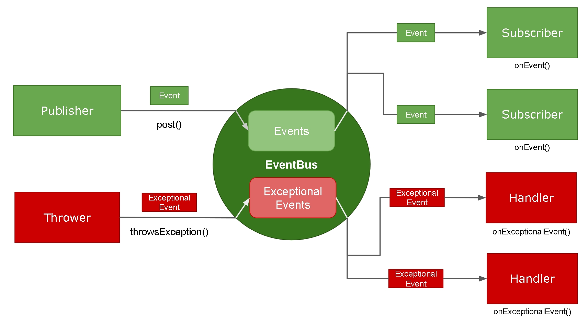

EventBus
========
[EventBus](https://greenrobot.org/eventbus/) is a publish/subscribe event bus for Android and Java.<br/>


[](https://travis-ci.org/greenrobot/EventBus)
[](https://twitter.com/greenrobot_de)

EventBus...

 * simplifies the communication between components
    * decouples event senders and receivers
    * performs well with Activities, Fragments, and background threads
    * avoids complex and error-prone dependencies and life cycle issues
 * makes your code simpler
 * is fast
 * is tiny (~60k jar)
 * is proven in practice by apps with 1,000,000,000+ installs
 * has advanced features like delivery threads, subscriber priorities, etc.

EventBus (Normal Flow) in 3 steps
-------------------
1. Define events:

    ```java  
    public static class MessageEvent { /* Additional fields if needed */ }
    ```

2. Prepare subscribers:
    Declare and annotate your subscribing method, optionally specify a [thread mode](https://greenrobot.org/eventbus/documentation/delivery-threads-threadmode/):  

    ```java
    @Subscribe(threadMode = ThreadMode.MAIN)  
    public void onMessageEvent(MessageEvent event) {/* Do something */};
    ```
    Register and unregister your subscriber. For example on Android, activities and fragments should usually register according to their life cycle:

   ```java
    @Override
    public void onStart() {
        super.onStart();
        EventBus.getDefault().registerSubscriber(this);
    }
   
    @Override
    public void onDestroy() {
        super.onDestroy();
        EventBus.getDefault().unregisterSubscriber(this);
    }
    ```
    
    On Android services, register and unregister according to their life cycle as well:

   ```java
    @Override
    public void onCreate() {
        super.onCreate();
        EventBus.getDefault(this).registerHandler(this);
    }
    
    or
    
    @Override
    public int onStartCommand(Intent intent, int flags, int startId) {
        int value = super.onStartCommand(intent, flags, startId);
        EventBus.getDefault(this).registerHandler(this);
        return value;
    }

    @Override
    public void onDestroy() {
        super.onDestroy();
        EventBus.getDefault(this).unregisterHandler(this);
    }
    ```

3. Post events:

   ```java
    EventBus.getDefault().post(new MessageEvent());
    ```

EventBus (Exceptional Flow) in 3 steps
-------------------
1. Define exceptional events:

    ```java  
    public static class ExceptionalEvent { /* Additional fields if needed */ }
    ```

2. Prepare handlers:
    Declare and annotate your handling method, optionally specify a exceptional thread mode:  

    ```java
    @Handle(threadMode = ExceptionalThreadMode.MAIN)  
    public void onExceptionalEvent(ExceptionalEvent exceptionalEvent) {/* Do something */};
    ```
    Register and unregister your handler. For example on Android, activities and fragments should usually register according to their life cycle:

   ```java
    @Override
    public void onStart() {
        super.onStart();
        EventBus.getDefault().registerHandler(this);
    }
 
    @Override
    public void onDestroy() {
        super.onDestroy();
        EventBus.getDefault().unregisterHandler(this);
    }
    ```
    
    On Android services, register and unregister according to their life cycle as well:

   ```java
    @Override
    public void onCreate() {
        super.onCreate();
        EventBus.getDefault(this).registerHandler(this);
    }
    
    or
    
    @Override
    public int onStartCommand(Intent intent, int flags, int startId) {
        int value = super.onStartCommand(intent, flags, startId);
        EventBus.getDefault(this).registerHandler(this);
        return value;
    }

    @Override
    public void onDestroy() {
        super.onDestroy();
        EventBus.getDefault(this).unregisterHandler(this);
    }
    ```

3. Throw exceptional events:

   ```java
    EventBus.getDefault().throwsException(new ExceptionalEvent());
    ```
   
Read the full [getting started guide](https://greenrobot.org/eventbus/documentation/how-to-get-started/).

There are also some [examples](https://github.com/greenrobot-team/greenrobot-examples).

**Note:** we highly recommend the [EventBus annotation processor with its subscriber index](https://greenrobot.org/eventbus/documentation/subscriber-index/).
This will avoid some reflection related problems seen in the wild.  

Add EventBus to your project
----------------------------

Via Gradle:
```gradle
allprojects {
    repositories {
        ...
        maven { url 'https://jitpack.io' }
    }
}

dependencies {
        implementation 'com.github.fabianojgf:EventBus:exception-handling-SNAPSHOT'
}
```

Via Maven:
```xml
<repositories>
    <repository>
        <id>jitpack.io</id>
        <url>https://jitpack.io</url>
    </repository>
</repositories>

<dependency>
    <groupId>com.github.fabianojgf</groupId>
    <artifactId>EventBus</artifactId>
    <version>exception-handling-SNAPSHOT</version>
</dependency>
```

R8, ProGuard
------------

If your project uses R8 or ProGuard add the following rules:

```bash
-keepattributes *Annotation*
-keepclassmembers class * {
    @org.greenrobot.eventbus.Subscribe <methods>;
}
-keep enum org.greenrobot.eventbus.ThreadMode { *; }
 
# And if you use AsyncExecutor:
-keepclassmembers class * extends org.greenrobot.eventbus.util.ThrowableFailureEvent {
    <init>(java.lang.Throwable);
}
```

Homepage, Documentation, Links
------------------------------
For more details please check the [EventBus website](https://greenrobot.org/eventbus). Here are some direct links you may find useful:

[Features](https://greenrobot.org/eventbus/features/)

[Documentation](https://greenrobot.org/eventbus/documentation/)

[Changelog](https://greenrobot.org/eventbus/changelog/)

[FAQ](https://greenrobot.org/eventbus/documentation/faq/)

How does EventBus compare to other solutions, like Otto from Square? Check this [comparison](COMPARISON.md).

License
-------
Copyright (C) 2012-2020 Markus Junginger, greenrobot (https://greenrobot.org)

EventBus binaries and source code can be used according to the [Apache License, Version 2.0](LICENSE).

Other projects by greenrobot
============================
[__ObjectBox__](https://objectbox.io/) ([GitHub](https://github.com/objectbox/objectbox-java)) is a new superfast object-oriented database.

[__Essentials__](https://github.com/greenrobot/essentials) is a set of utility classes and hash functions for Android & Java projects.

[__greenDAO__](https://github.com/greenrobot/greenDAO) is an ORM optimized for Android: it maps database tables to Java objects and uses code generation for optimal speed.
